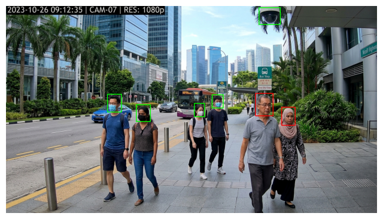
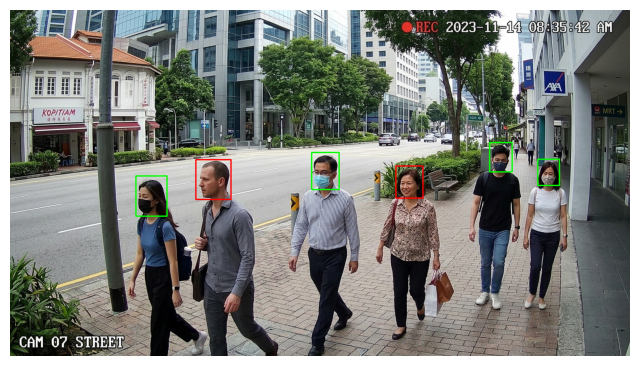
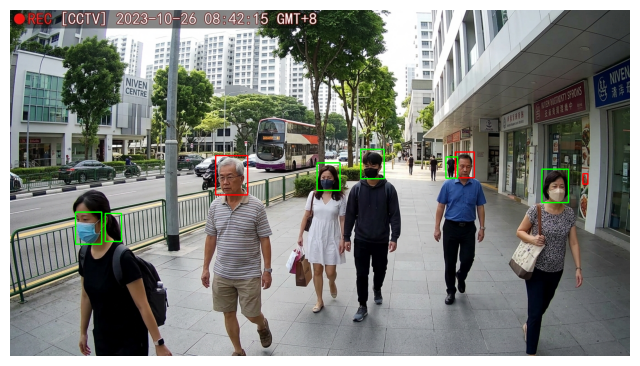
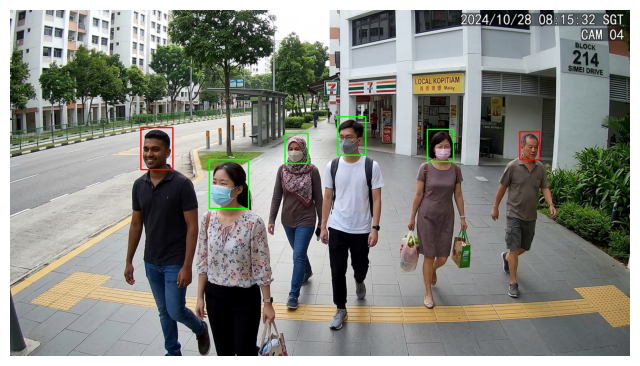
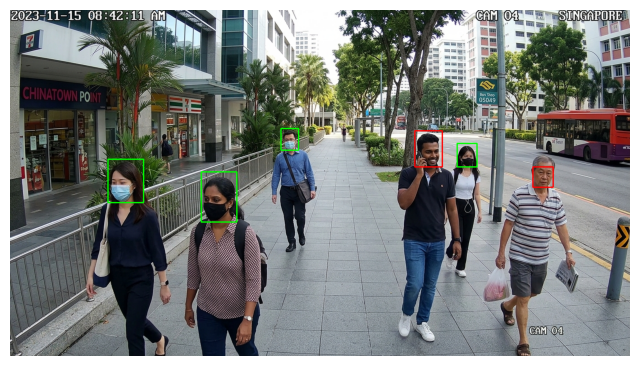

# Mask Detection with YOLOv8

Real-time face mask detection (mask / no-mask) built on YOLOv8, trained on a small public Roboflow dataset and then iteratively improved through five model versions after testing against real-world CCTV-style street photos exposed gaps that the validation metrics alone didn't show.

This repo documents the full iteration process, including the versions that made things worse, because that's a more honest and more useful record than only showing the final result.

## Contents

- `Roboflow_Model_Yolo_Mask.ipynb` — dataset download, class rebalancing, and training for all five model versions (v1–v5)
- `Test_Model_Yolo_Mask.ipynb` — inference, threshold/resolution experiments, and an MQTT-based deployment demo
- `assets/` — example detection results on real street photos (see below)

## Problem & Dataset

The base dataset is [`mask-wearing`](https://universe.roboflow.com/joseph-nelson/mask-wearing) from Roboflow Universe (2 classes: `mask`, `no-mask`), which is quite small: 105 training images, 29 validation images. To improve coverage on harder real-world cases, a second public dataset was later merged in: [`Face-Mask-Detection`](https://universe.roboflow.com/hyssam-baccouche/face-mask-detection-djzcc) (848 images, 3 classes: `with_mask`, `without_mask`, `mask_weared_incorrect`), a Roboflow mirror of the Kaggle `andrewmvd/face-mask-detection` dataset. Its 3 classes were remapped onto the base 2-class scheme (`mask_weared_incorrect` → `no-mask`).

## Model Iterations

Validation is on the same 29-image held-out set throughout, so the numbers below are comparable across versions.

| Version | Backbone | Train imgsz | Data | mAP50 | mAP50-95 | Notes |
|---|---|---|---|---|---|---|
| v1 | YOLOv8n | 640 | 105 images | 0.849 | 0.499 | Baseline |
| v2 | YOLOv8s | 960 | 105 images | 0.828 | 0.505 | Bigger model + higher training resolution |
| v3 | YOLOv8s | 960 | +763 extra images | 0.848 | 0.480 | Fixed recall on hard faces, but introduced a bias toward predicting "mask" |
| v4 | YOLOv8s | 960 | v3 data, extra portion rebalanced | 0.828 | 0.473 | Looked solid on paper (no-mask precision 0.852), but real-world testing still showed occasional bias toward "mask" |
| v5 | YOLOv8s | 960 | v4 data, **total** class balance rebalanced (incl. the original 105) | 0.732 | 0.428 | Lower validation score, but the only version that classified every bare-face test case correctly |

v5's lower validation mAP looks like a regression on paper. In practice it isn't: the 29-image validation set has only 20 "no-mask" instances, so its score is very sensitive to a handful of images, and it doesn't reflect performance on the more varied real-world photos used for the checks below. Real-world testing on street photos was the deciding factor here, not the validation table.

## Known Limitations

- The original 105-image dataset is small and skews toward "mask" examples (573 mask vs. 123 no-mask instances), which is the root cause of the bias problems chased through v3–v5.
- Some specific poses/lighting/hijab-and-mask combinations still go undetected occasionally, even in the final version — this is a data coverage limit, not something inference-time tuning can fully fix.
- At low confidence thresholds, the model occasionally produces a false positive on a non-face object (observed once: a security camera housing, at low confidence).
- Final inference settings: `conf=0.1`, `imgsz=1280`, `agnostic_nms=True`, plus two custom post-processing filters (an oversized-box filter and a same-class duplicate-box filter) documented directly in the `detect_mask` function.

## Detection Results (v5, final configuration)

Real street photos, not seen during training, run through the final pipeline:

## Deployment Demo

`Test_Model_Yolo_Mask.ipynb` includes a small demo that runs detection on an uploaded image and publishes the JSON result to an MQTT broker (via [shiftr.io](https://www.shiftr.io/)'s public test broker), simulating how this could feed into a monitoring dashboard.

## Setup

Both notebooks are built to run in Google Colab with a GPU runtime.

1. Get a free API key from [Roboflow](https://app.roboflow.com/settings/api).
2. In Colab, add it as a secret named `ROBOFLOW_API_KEY` (key icon in the left sidebar), or enter it manually when prompted.
3. Run `Roboflow_Model_Yolo_Mask.ipynb` top to bottom (or use the "fast-forward" cell before the v5 section if you already have earlier `.pt` checkpoints and just want to reproduce the later steps).
4. Trained weights are saved to `MyDrive/yolo-mask-detection/` in Google Drive.
5. Run `Test_Model_Yolo_Mask.ipynb`, which loads the model from Drive and lets you upload images for detection.

## License

MIT — see [LICENSE](LICENSE).
